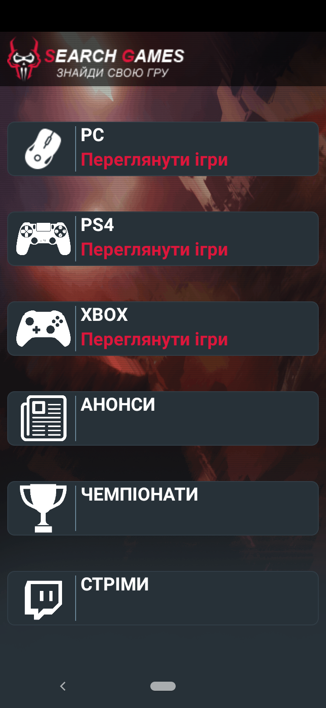
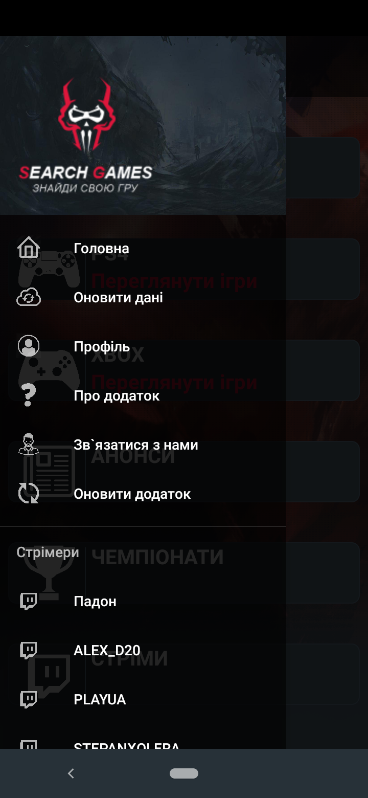
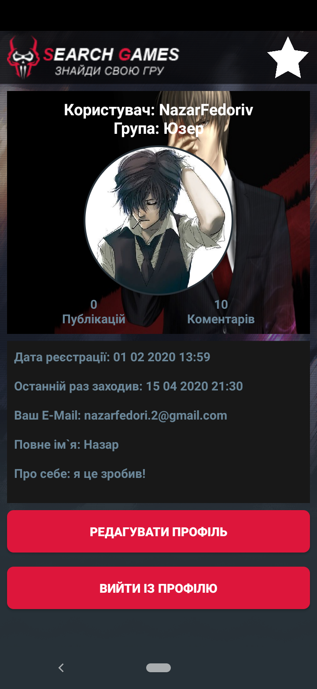
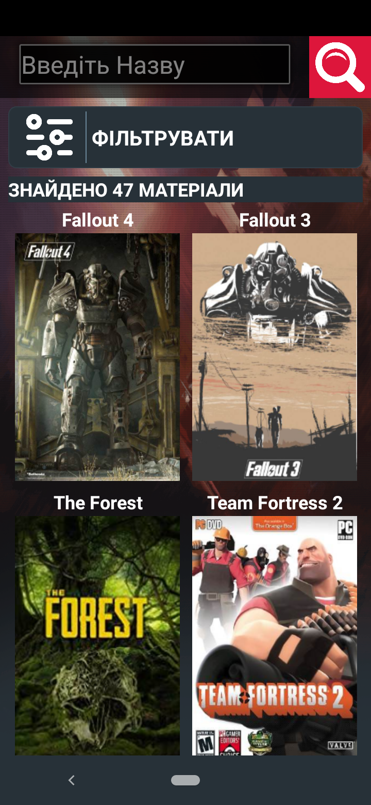
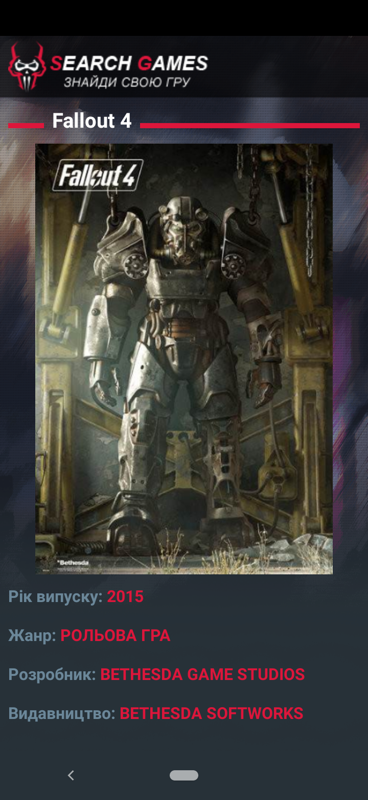
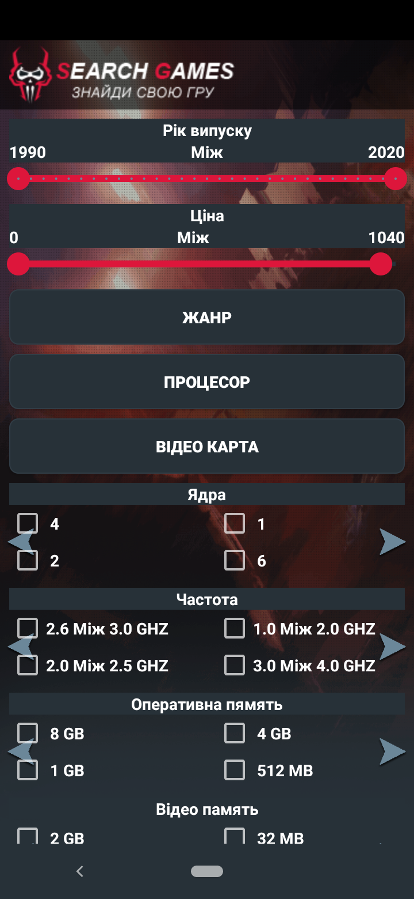
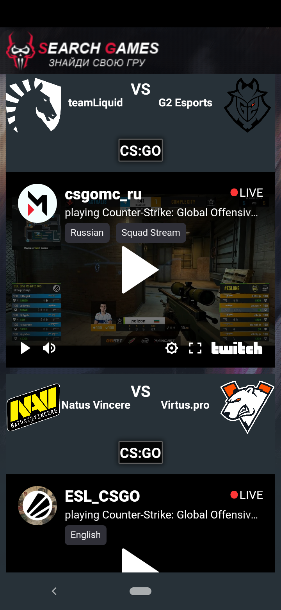
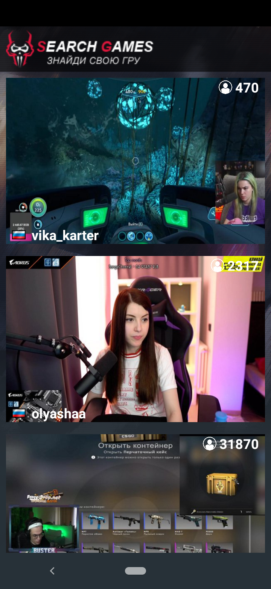

<p align="center"></p>
<h1 align="center">Search Games</h1>

## Description
<b>EN:</b>

For full operation, the application needs to register the API key for YouTube and replace it in the project file ["/app/src/main/java/com/example/searchgame2/Activity/Full_StoriActivity.java"](/app/src/main/java/com/example/searchgame2/Activity/Full_StoriActivity.java) line №94 "public static final String key =" [ YOUR_YouTube_API_KEY] ";".
 
Description:
 
The application was created by a person under the pseudonym Cool-Otaku full name: Fedorov Nazariy Petrovich, this application is designed to search for games and view them. You can also share your impressions of any game, view and order them on the game platform. Usually the Steam platform, but there may be another. The application has a system of accounts that synchronize with our site Search-Games.online. Here you can also watch your favorite streamers and championships in various games! For convenience and the main idea, the application has a filtering system by system requirements, genres for your taste, and price and years. If you want to play something but don't know which game is right for you? Join us and find a game to your liking!

User's Guide: In the Filter section, you can apply a game filter by genre, CPU and graphics card power, price, RAM, and more. To call up the list of genres, processors, video cards, you need to press the appropriate button. Also in the filter you can sort games - by name and age, both ascending and descending. Filtering games by year and price is set by the interval from which to what value. If you want to find a game by its name, but can't remember its name, then just enter some part of the name, some word but from the original. You don't have to go to the profile to write a comment, you can just enter your email address and name. If you want to buy the game, then on the game page click on the button: Buy on Steam. And you can also add the game to your favorites, so as not to forget about it. Games that you have added to favorites can be viewed in your profile.

To register your profile, you need to go to our website and fill in all the necessary fields of the form. To log in to the account you need to write your login or email address and password. You can change your profile picture (avatar) both through the application and the site, the limit for the picture - the size of not more than one megabyte. Once you have registered and logged in, you can leave comments in games on your behalf without entering the name and Email fields in the comment form. You can also rate games on your behalf only once for that game and the category you were rated on, with a score ranging from one to ten.
If you want to see the profile of the user who wrote the comment, just click on his name in the comment. So you can contact him to write an e-mail or private message. Almost every activity has a navigation of the side menu, with the help of the menu you can go to special activities from anywhere in the application. To open the side menu, swipe from the left edge of the screen to the right, or tap the app logo. You should also update the application from time to time, the local database is made to optimize the application, and faster functionality. On our site you can download the latest version of the application. If you suddenly stopped working the application, or the system crashes? Don't worry, just go to the phone settings, then to the apps tab and find our app there, then clear the app's memory. If this did not help you, then the update came out, just download the application again from the platform where you downloaded it. Note: (you can download the application from our site Search-Games.online).

The application has an update check system, and it is recommended to install new versions of the application. Because in the new version something changes for the better, or it becomes easier to use the application or bugs and bugs are fixed. If you have any problems or you find an error in the application, please contact us. To do this, go to the "Contact Us" menu and write us an email on your behalf and email address. Most activities do not work without an Internet connection, so you may see that you do not have an Internet connection. Many of the images displayed on game pages are cached. Therefore, if there is not enough memory on your device, clear the cache.

<b>UA:</b>

Для повноцінної роботи, додатка потрібно зареєструвати ключ API для YouTube та замінити в файлі проекту ["/app/src/main/java/com/example/searchgame2/Activity/Full_StoriActivity.java"](/app/src/main/java/com/example/searchgame2/Activity/Full_StoriActivity.java) рядок №94 "public static final String key="[YOUR_YouTube_API_KEY]";".
 
Опис:
 
Додаток створений особою під псевдонімом Cool-Otaku повне ім’я: Федорів Назарій Петрович, цей додаток призначений для пошуку ігор, і їх перегляду. Також можна ділитися враженнями про яку небудь гру, переглядати і замовляти їх на ігровій платформі. Зазвичай платформа Steam, але може і зустрітися інша. В додатку присутня система акаунтів, які синхронізують із нашим сайтом Search-Games.online. Тут ви можете також дивитися любимих стрімерів та чемпіонати по різних іграх! Для зручності та й за головною задумкою, в додатку присутня система фільтрації по системних вимогах, жанрах на ваш смак, та по ціні і роках. Якщо хочете щось зіграти, але не знаєте, яка гра вам підійде ? Приєднуйтесь до нас, і знайдіть гру на ваш смак !

Довідник для користувача: В розділі Фільтрувати можна застосувати фільтр ігр по жанрах, потужності процесора і відеокартах, ціні, оперативній пам’яті тощо. Щоб викликати список жанрів, процесорів, відеокарт потрібно зажати на відповідній кнопці. Також в фільтрі ви можете сортувати ігри - по назві та рокам, як по зростанню, так і по спаданню. Фільтрація ігор по роках і ціні виставляється інтервалом з якого по яке значення. Якщо ви хочете знайти гру по назві, але не пам’ятаєте її назву, тоді просто введіть якусь частину назви, якесь слово але з оригіналу. Для написання коментаря не обов’язково заходити в профіль, можна просто ввести свою електронну адресу та ім’я. Якщо ви хочете придбати гру, тоді на сторінці із грою клацніть на кнопку: Придбати в Steam. І також ви можете добавити гру в обране, для того щоб не забути про неї. Ігри які ви добавили до обраного, можна переглянути у вашому профілю.

Щоб зареєструвати свій профіль, вам необхідно зайти на наш сайт і там заповнити всі необхідні поля форми. Для входу в акаунт потрібно написати свій логін або адрес електронної пошти та пароль. Ви можете міняти свою профільну картинку (аватарку) як через додаток так і сайт, обмеження для картинки – розмір не більше одного мегабайта. Коли ви зареєстровані і ввійшли у профіль, ви можете залишати коментарі в іграх від свого імені не вводячи поля ім’я та Email в формі для написання коментарів. Також ви можете оцінювати ігри від свого імені тільки один раз для цієї гри та категорії по якій оцінювали, оцінка ставиться від одного до десяти балів.
Якщо ви хочете переглянути профіль користувача, який написав коментар, просто нажміть на його імені в коментарі. Так ви зможете звязатися з ним написати лист на електронну пошту або приватне повідомлення. Майже на кожній активності присутня навігація бокового меню, при допомозі меню ви зможете переходити на спеціальні активності з любої точки додатка. Щоб відкрити бокове меню протягніть пальцем від лівого краю екрана на право, або натисніть на логотип додатка. Також слід час від часу оновляти додаток, локальна база даних зроблена для оптимізації додатка, і швидшого функціоналу його. На нашому сайті ви можете скачати останню версію додатка. Якщо в вас раптом перестав працювати додаток, або вилітає системи? Не хвилюйтесь, просто зайдіть в налаштування телефона, далі на вкладку додатки і знайдіть там наш додаток, після цього очистіть пам’ять додатка. Якщо вам це не допомогло, значить вийшло оновлення, просто ще раз завантажте додаток із тої платформи де ви його скачали. Примітка: (ви можете завантажити додаток із нашого сайту Search- Games.online).

В додатку присутня система перевірки на оновлення, і рекомендується встановлювати нові версії додатка. Бо в нових версія щось змінюється на краще, або простіше стає користуватись додатком або виправляються помилки і баги. Якщо у вас виникли якісь проблеми або ви знайшли якусь помилку в додатку, просимо звернутися до нас. Для цього перейдіть в меню по пункту «Зв’язатися з нами» і напишіть нам лист від свого імені та адреси електронної пошти. Більшість активностей не працюють без підключення до інтернету, тому може з’являтися надпис по відсутність підключення до інтернету. Багато картинок, які відображаються на сторінках з іграми завантажуються в кеш пам’ять. Тому якщо не вистачає пам’яті на вашому пристрої, очищайте кеш пам’ять.

#
## Screenshots
<p>
  
  
  
  
  
  
  
  
</p>

#

## Technologies used

- General authorization system (web and mobile application)
- Creating my own API (without JSON)
- Working with the Twitch API

#

## License

```
© 2020, CoolOtaku (ericspz531@gmail.com)
```
